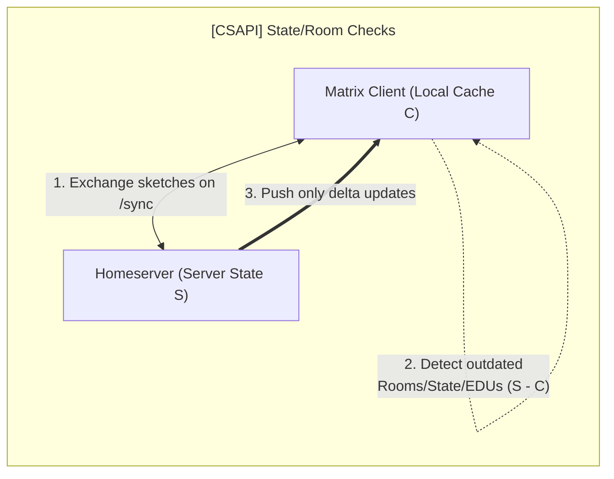
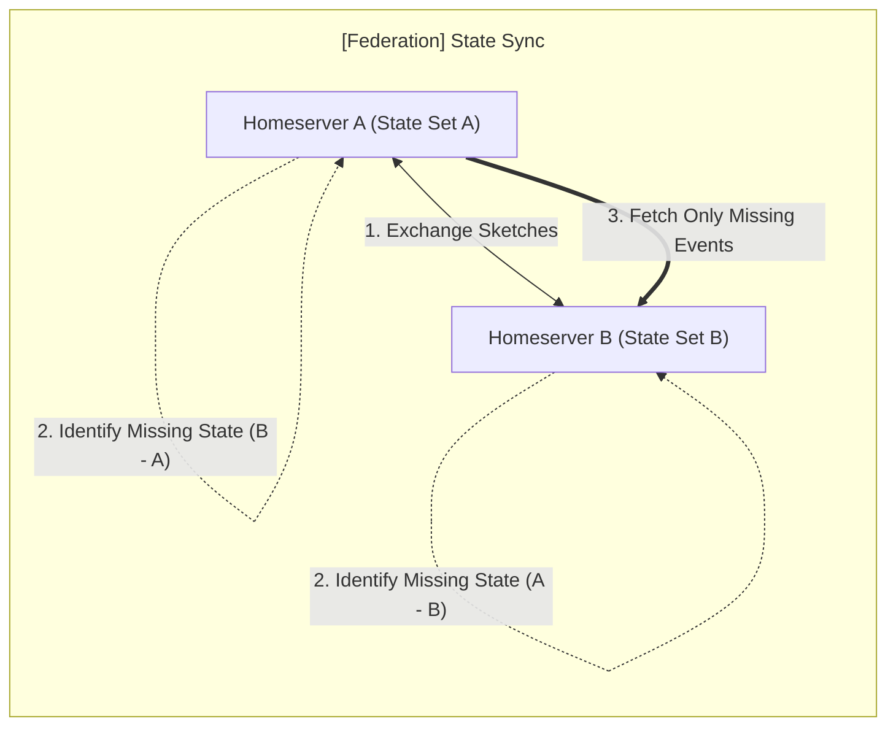

## CSAPI integrity

Client developers are frequently blamed when servers fail to properly send down
all required `/sync` data. Take `/v3` as a basic example ( these issues can also
affect `/v5`, but the application of set reconciliation to SSS is out of scope
for this blog post).

Some commonly reported issues:

1. **Left rooms reappearing** or sticking around;
2. **State drift**, client state resets (old profile photo/name, incorrect
   member list);
3. Zombie **read receipts** (similar to left rooms, they keep reappearing).

<!-- markdownlint-disable MD024 -->

### How set reconciliation can help

Rather than falling back to the grand old, often painfully slow "clear cache &
reload," efficient set reconciliation can instantly send the client precisely
what it missed, either via the following `/sync` request or a custom exchange,
endpoint, or negotiation.

The user/client initiate this request via a new, less sledgehammery **"sync
cache" button** (rather than the **infamous "clear cache"**). Clicking the
button and retrieving the data then applies the missing delta and, if the server
has a fully accurate state, restores a clean view to the client and user.

### Bonus consideration / thought experiment

**Problem:** How do you know, other than trust, that the client actually holds
all the relevant data requested from the server and that **none** has been lost?

The conventional answer is we just trust Google or we trust matrix.org, but this
answer seems unsatisfactory. The more interesting approach is to apply clever
mathematical techniques or encoding tricks to compare large amounts of data
without sending or transmitting large amounts of data.

What is a "zero-knowledge" proof or succinct STARK anyway? What's the connection
to the encoding techniques used in MSC4521?

---

## Federation state synchronization

During live federation, `/state_ids` is a fallback in some cases if
`/get_missing_events`

See below table for rough estimate of network bandwidth savings on `/state_ids`.

<!-- markdownlint-disable MD013 -->

| Approach | Expected bandwidth $(\|S\| = 10^5, d = 100)$ | Expected round-trip time |
| -------- | -------------------------------------------: | -----------------------: |
| Naive    |      50 bytes/event × 10,000 events = 500 KB |                  0.5 sec |
| MSC4521  |  65 bytes/event × 100 events + 3 KB = 9.5 KB |                  0.2 sec |

<!-- markdownlint-enable MD013 -->

### How set reconciliation can help

This MSC promises to reduce the network bandwidth of `/state_ids` exchanges and
the overall allocation of strings into a set (generally slower than an optimized
bitmap set comparison, but not a huge performance concern).

In general, the `/state_ids` endpoint is not especially expensive, but it can be
under heavy federation. The benefits become far more substantial if we consider
large rooms (over 100,000 members) or if we widen the query to include _all_
prior state events (not just currently resolved ones).

A given server, if it diverges, can reach out to a list of other servers (either
admin-defined, or randomly selected or ranked). By reaching out to 10 or 20
servers (or however many are in the room, if fewer), the resident server can
increase their chances of filling in gaps/holes. A strict collection of state
IDs today is complicated by ordinary (potentially missing) message events
interlacing with state events (see State DAGs[^1],).

It can also more greatly optimize the `GET /state` endpoint, but this exists
today mostly for legacy/compatibility reasons, so optimizing it is a lower
priority.

### Future considerations

Applying "periodic" room-state reconciliation between other homeservers, MSC4521
provides greater assurance of consensus among "authoritative" peers. It can
signal to admins divergent rooms (rate limiting the logs), and it can allow
manual state comparison over federation if the admin is especially determined to
align or diagnose their room(s).

<!-- References -->

[^1]:
    _MSC4242: State DAGs by kegsay · Pull Request #4242 ·
    matrix-org/matrix-spec-proposals_
    <https://github.com/matrix-org/matrix-spec-proposals/pull/4242>
