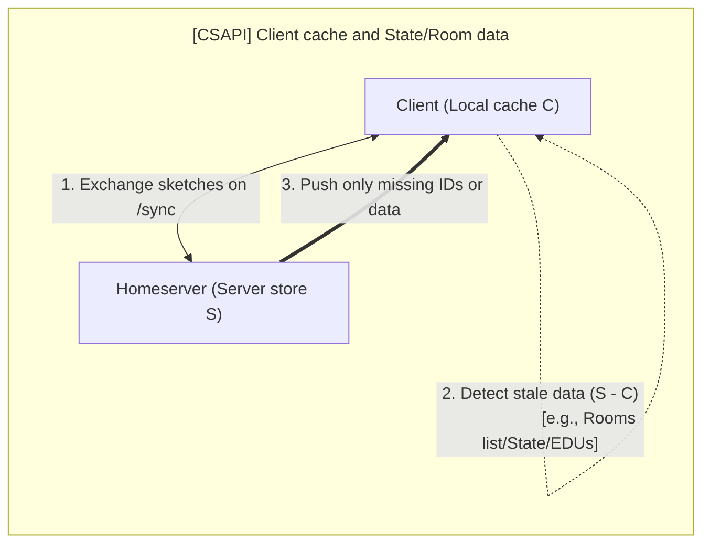
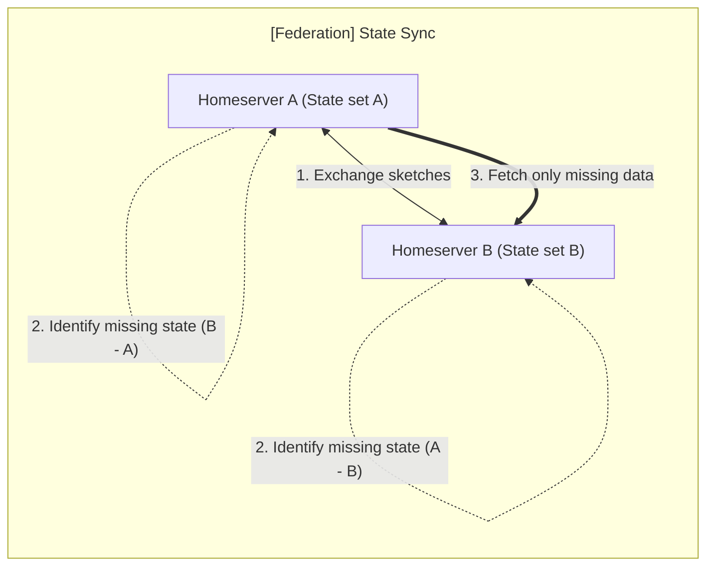

This post contains a growing list of optimizations, new use cases, or features
provided by MSC4521.

## CS-API integrity

Client developers are frequently blamed when servers fail to properly send down
all required `/sync` data. Take `/v3` as a basic example, and let's tally common
reports. These issues can also affect `/v4` or `/v5` (SSS), but any role of set
reconciliation in repairing SSS cache is both more speculative and technically
out of scope[^v5_complexity] for this blog post. The `/v3` sync contract is
better understood and easier to model.

Some commonly reported UI issues from Synapse users:

1. **Left rooms reappearing** or sticking around;
2. **State drift**, client resets (old profile photos/names, incorrect member
   list);
3. Zombie **read receipts** (similar to left rooms, they keep reappearing).

The Conduit family often experiences these same glitches. In some cases, the
glitches may be deterministic: if you view from a second client (Element), you
may see precisely the same data issue as your first (Cinny); similarly, even
after a cache clear and initial sync, the issue can sometimes stay.

On the other hand, clients can also sometimes corrupt their own caches.
Especially during development, when code is being tested and tweaked by
developers and run locally, the client cache likely must be cleared. If the
client developer is testing on a personal account with many rooms, a fresh
initial sync won't be fast, and a fast reconciliation mechanism would likely be
welcome (this is just a developer-experience consideration; the end-user
experience discussion is below).

<!-- markdownlint-disable MD024 -->

### How set reconciliation can help

Rather than falling back to the abysmally bad, often painfully slow "clear cache
& reload" — efficient set reconciliation can instantly send the client precisely
what it missed, either via the following `/sync` request or a custom exchange,
endpoint, or negotiation.

The user/client initiates this request via a new, less sledgehammery **"sync
cache" button** (rather than the **infamous "clear cache"**). Clicking the
button and retrieving the data then applies the missing delta and, if the server
has a fully accurate state, restores an accurate view to the client and user.

### Bonus consideration/thought experiment

**Problem:** How do you know, other than trust, that the client actually holds
all the relevant data requested from the server and that **none** has been lost?

The conventional answer is we trust the software and the server developers. But
homeserver development is notoriously difficult and tedious. Blindly trusting
that nothing has fallen through the cracks leaves the end-user with no quick way
to verify their local store. If their eye catches something in their Element or
Cinny UI client, they might suspect a state reset or cache window miss has
occurred. Every user instinctively reaches for the sledgehammer solution, the
notorious "reset cache" button, which is so often used as an inconvenient
band-aid to repair edge cases like this.

This is clearly not ideal. The user is stuck manually visually scanning to check
for potential signs of a de-sync issue, and must perform a full cache clear and
initial sync (which can be slow). The more interesting approach is to apply
clever math or encoding techniques[^syndrome_decoding_algebraic_sets] to compare
large amounts of data over the wire _without_ needing to send or transmit
significant amounts of it.

<!-- markdownlint-disable MD033 -->

The use case still exists if the `/sync` code is completely stabilized.
End-users and client developers alike **may not fully trust the _incremental_
model**, even for `/v3`, and they are well within their rights to request a
fast, **<u>independent</u> mechanism which cleverly encodes the _full_ data
set** and returns any missing events (and lists any extra the client may somehow
have).

<!-- markdownlint-enable MD033 -->

If the user presses the "sync cache" or "repair cache" button (however we decide
to label it), and their client receives back an empty list of missing events,
then they know (and the client UI can confirm with a toast message) that their
cache was already healthy and fully in agreement with the server.

This provides a fast, reliable way to _prove_ to the end-user's client that it
has all the data the server has, and that none of it has been accidentally lost
during the potentially error-prone shuffle of ongoing data down and along the
incremental `/sync` pipeline.

---

## Federation state synchronization

During live federation, `/state_ids` is a recommended fallback if
`/get_missing_events` fails[^state_ids_fallback].

Some homeservers also implement an admin command to compare state with other
homeservers in a given room, allowing manual diagnosis of local state issues and
broad manual ranking of peers — estimating, by skimming data, which peer(s) has
the best or most trustworthy state.

See the table below for estimates of network bandwidth savings on the
`/state_ids` endpoint.

| Approach | Estimated bandwidth $(\|S\| = 10,000, d = 100)$ |
| -------- | ----------------------------------------------: |
| Naive    |         50 bytes/event × 10,000 events = 500 KB |
| MSC4521  |     100 bytes/event × 100 events + 3 KB = 13 KB |

### How set reconciliation can help

This MSC promises to reduce the network bandwidth of `/state_ids` exchanges and
the overall allocation of strings into a set, which is generally slower than an
optimized bitmap set comparison but not a pressing performance concern.

In general, the `/state_ids` endpoint is not expensive, but it can be under
heavy federation.

The benefits become far more substantial if we consider large rooms (over
100,000 members) or if the query includes all prior state events (not just the
currently resolved set).

State res (v2.1 particularly) needs the "union" and "intersection" of some event
sets. After fetching them over the network and merging them into their local
store, some implementations will then compute the union(s) and intersection(s)
over `base64url` strings, rather than `int64` sets or `RoaringTreemap` layouts.
This only becomes a concern during peak hours or higher federation rates, when
operating on strings can noticeably slow things down. So, while generally
trivial, moving to a `shorteventid` cache is a goal for all implementations.

MSC4521 can also optimize the `GET /state` endpoint, but this is mostly for
initial full joins and perhaps for legacy/compatibility reasons. Optimizing it
is therefore either not under this MSC’s purview or a lower priority.

### Possible remediation route/admin command

A given server, if it diverges, can reach out to a list of other servers (either
admin-defined, or randomly selected or ranked). By reaching out to 10 or 20
servers (or however many are in the room, if fewer), the resident server can
increase their chances of filling in gaps/holes. A strict traversal and
collection of state IDs today is complicated by ordinary (potentially missing)
message events interlacing with state events (see State DAGs[^msc4242], which
replaces `auth_events` with `prev_state_events`, and benefits from a companion
proposal like MSC4521 to achieve higher rates of synchronization across the
federation and improved rates of consistency and rapid event dispersal).

### Cryptocurrencies and other prior arts

Bitcoin merged its equivalent years ago and recently integrated it with a
gossip-based middle tier[^bitcoin_minisketch_doc].

Ethereum also has relevant whitepapers and proposals, some of which are in
production[^ethereum_blog].

One of the main sources in the MSC[^optimal_polynom] details a one-to-many
broadcast scheme.

Similar reconciliation results are obtained—for example in Git, DynamoDB
[^db_replica_repair], and other peer-to-peer frameworks—even if different
methods are used.

### Future considerations

Applying "periodic" room-state reconciliation between other homeservers, a
future MSC can apply MSC4521 for greater assurance of convergence with
"authoritative" peers. It can signal divergent rooms to admins (via logs) and
allow manual state comparison over federation if the admin is especially
determined to align or diagnose their room(s).

Furthermore, providing end-users and clients with the ability to quickly verify
complete agreement between large sets of local and remote data is a convenience
gain and quality assurance to the average user. Who doesn't want to know they're
working with the complete set?

<!-- markdownlint-disable MD033 -->

_<u>AI Disclosure:</u> mermaid diagrams adapted from Gemini 3.1 Pro output.
Grammarly Writing Assistant (unpaid) consulted for basic grammar._

<!-- markdownlint-enable MD033 -->

### Footnotes and sources consulted

[^v5_complexity]:
    Since SSS `/sync` has many more filters and properties and allows clients to
    configure custom timeline boundaries and selective state filters, correctly
    partitioning the set of server events — to precisely align with the client's
    start boundary / limited view and obey all filter rules — may be difficult.

[^msc4242]:
    _MSC4242: State DAGs by kegsay · Pull Request #4242 ·
    matrix-org/matrix-spec-proposals_
    <https://github.com/matrix-org/matrix-spec-proposals/pull/4242>

[^state_ids_fallback]:
    "... server may use the `/get_missing_events` API to acquire the events..."
    _Matrix Spec: Server-Server API — Backfilling and retrieving missing
    events._
    <https://spec.matrix.org/latest/server-server-api/#backfilling-and-retrieving-missing-events>

    **NOTE:** The spec does _not_ explicitly require this, but it is encouraged
    in Complement tests.

[^syndrome_decoding_algebraic_sets]:
    The MSC4521 proposal combines ideas and techniques from different papers,
    but this one contributes the "strata estimator" idea. The "invertible bloom
    filter" discussed in this paper is _not_ used in MSC4521, which uses the
    BCH/field encoding from `minisketch`.

    _What’s the Difference? Efficient Set Reconciliation without Prior Context_
    (2011).
    <https://conferences.sigcomm.org/sigcomm/2011/papers/sigcomm/p218.pdf>

[^bitcoin_minisketch_doc]:
    See: "2025, Gossip analysis to inform minisketch-like set reconciliation
    protocol for LN"

    _Minisketch | Bitcoin Optech_ <https://bitcoinops.org/en/topics/minisketch/>

[^ethereum_blog]:
    _"Ethereum's ERC-20 tokens, typically fungible and standardized, behave very
    differently from NFTs (non-fungible tokens) that follow ERC-721 or ERC-1155
    standards. This variation in blockchain behavior introduces complexities in
    reconciliation..."_

    Crypto Reconciliation: What It Is & Why It Matters
    <https://www.osfin.ai/blog/crypto-reconciliation>

[^optimal_polynom]:
    _"... these protocols can be adapted to work over a broadcast channel,
    allowing many clients to reconcile with one host based on a single
    broadcast, even if each client is missing a different subset."_

    Set reconciliation with nearly optimal communication complexity | IEEE
    Journals & Magazine <https://ieeexplore.ieee.org/document/1226606>

[^db_replica_repair]:
    See slide 35 for some distributed database proposals/potential improvement
    designs.

    _Yours, Mine, and Ours: Efficient Set Reconciliation in O(n log n) of the
    SET DIFFERENCE by Pat Helland and Daniel May._
    <https://www.slideshare.net/slideshow/yours-mine-and-ours-efficient-set-reconciliation-in-o-n-log-n-of-the-set-difference-by-pat-helland-and-daniel-may/286402797>
