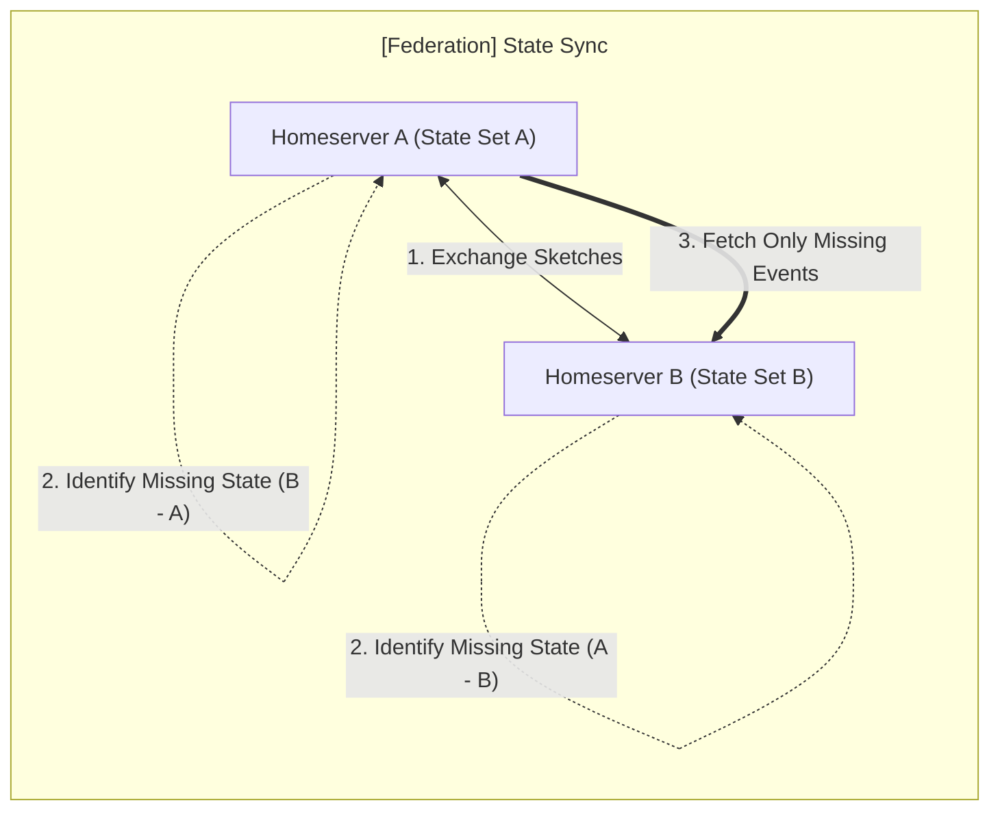
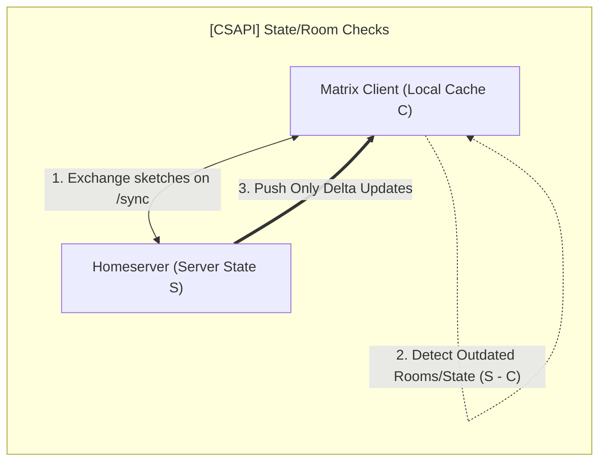

## Use cases (proposed)

### Federation state synchronization

|         | Expected bandwidth, 10K state events, 100 differing |
| ------- | --------------------------------------------------- |
| Naive   | 50 bytes/event × 10,000 events = 500 KB             |
| MSC4521 | 65 bytes/event × 100 events + 3 KB = 9.5 KB         |

---

### CSAPI integrity

Client developers are frequently blamed when servers fail to properly send down
all required `/sync` data. Take `/v3` as a basic example ( these issues can also
affect `/v5` but the application of set reconciliation to SSS is out of scope
for this blog post).

Some commonly reported issues:

1. Left rooms reappearing or sticking around;
2. State drift, client state resets (old profile photo/name, incorrect member
   list);
3. Zombie read receipts (similar to left rooms, they keep reappearing).

#### How set reconciliation can help

Rather than falling back to the grand old, often painfully slow "clear cache &
reload," efficient set reconciliation can instantly send the client precisely
what it missed, either via the following `/sync` request or a custom exchange,
endpoint, or negotiation.
