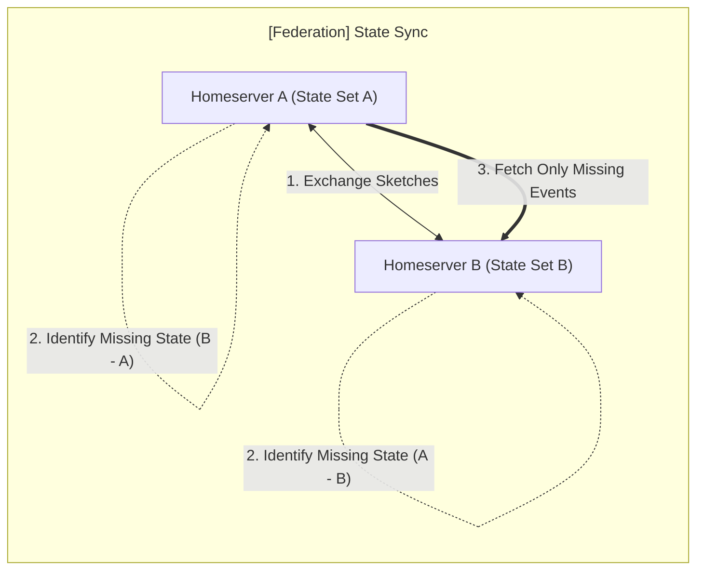
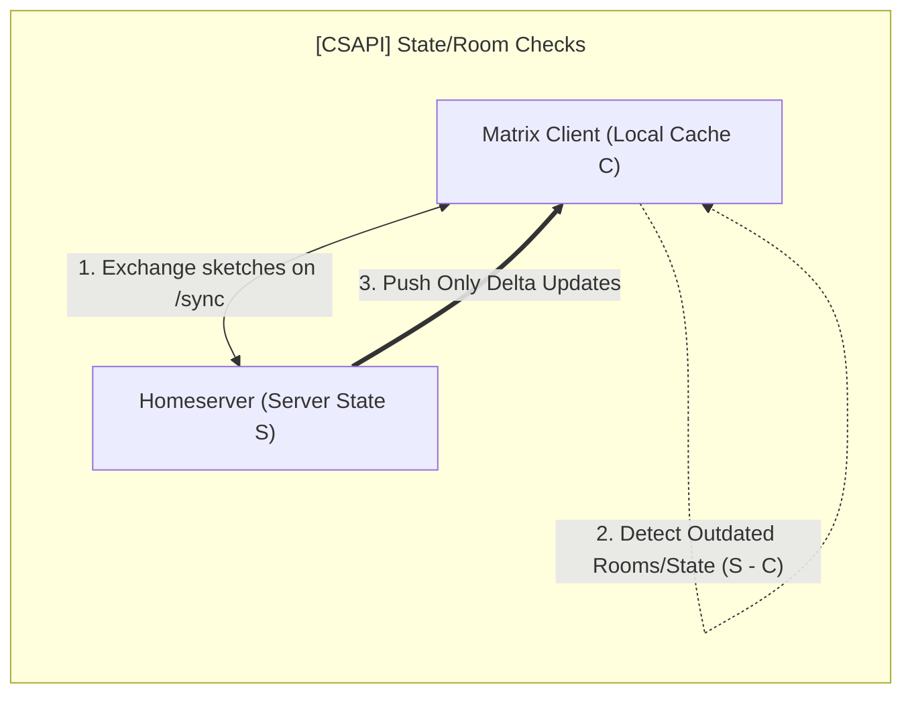

## Use cases (proposed)

### Federation state synchronization

Expected bandwidth, 10K state events, 100 differing:

```mermaid
%%{init: {"flowchart": {"subGraphTitleMargin": {"top": 15, "bottom": 15}}}}%%
flowchart TD
    subgraph Federation["[Federation] State Sync"]
        direction TB
        HS1["Homeserver A (State Set A)"]
        HS2["Homeserver B (State Set B)"]

        HS1 <-->|"1. Exchange Sketches"| HS2
        HS1 -. "2. Identify Missing State (B - A)" .-> HS1
        HS2 -. "2. Identify Missing State (A - B)" .-> HS2
        HS1 ==>|"3. Fetch Only Missing Events"| HS2
    end
```

### CSAPI zombified "left-room" check

```mermaid
%%{init: {"flowchart": {"subGraphTitleMargin": {"top": 15, "bottom": 15}}}}%%
flowchart TD
    subgraph CSAPI["[CSAPI] State/Room Checks"]
        direction TB
        Client["Matrix Client (Local Cache C)"]
        Server["Homeserver (Server State S)"]

        Client <-->|"1. Exchange sketches on /sync"| Server
        Client -. "2. Detect Outdated Rooms/State (S - C)" .-> Client
        Server ==>|"3. Push Only Delta Updates"| Client
    end
```
