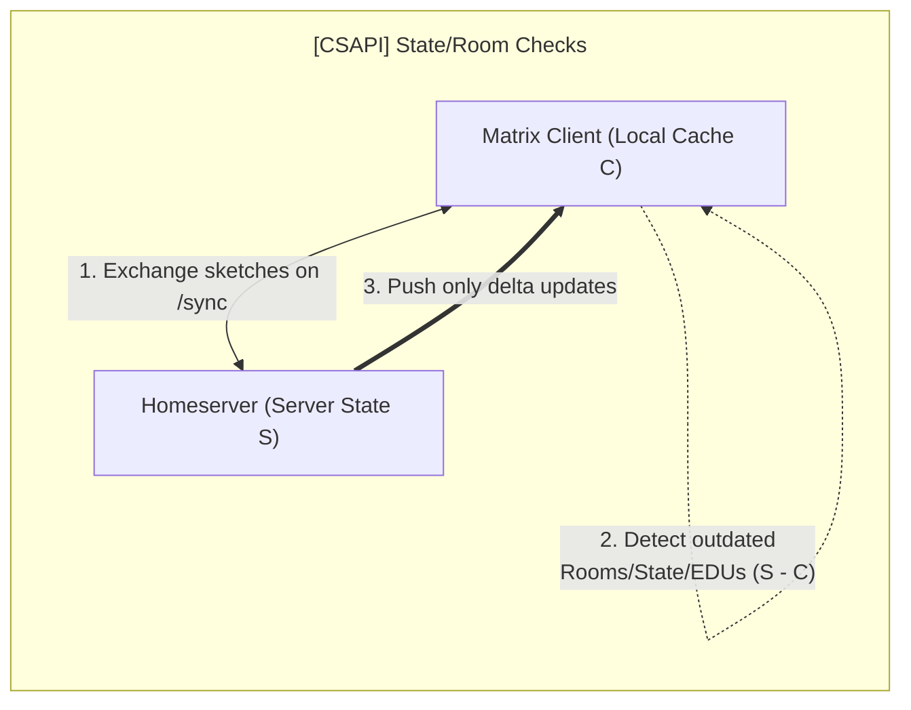
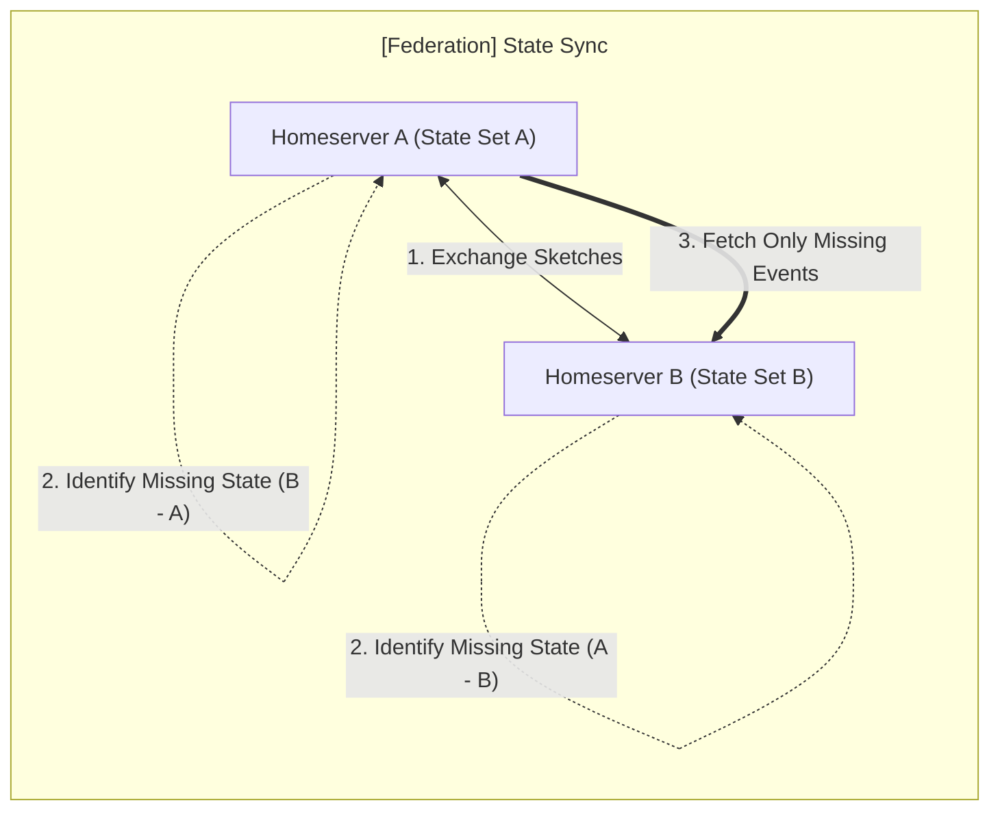

This post contains a growing list of optimizations, new use cases, or features
provided by MSC4521.

## CS-API integrity

Client developers are frequently blamed when servers fail to properly send down
all required `/sync` data. Take `/v3` as a basic example (these issues can also
affect `/v5`, but the application of set reconciliation to SSS is both highly
speculative and out of scope for this blog post).

Some commonly reported UI issues:

1. **Left rooms reappearing** or sticking around;
2. **State drift**, client resets (old profile photos/names, incorrect member
   list);
3. Zombie **read receipts** (similar to left rooms, they keep reappearing).

<!-- markdownlint-disable MD024 -->

### How set reconciliation can help

Rather than falling back to the abysmally bad, often painfully slow "clear cache
& reload" — efficient set reconciliation can instantly send the client precisely
what it missed, either via the following `/sync` request or a custom exchange,
endpoint, or negotiation.

The user/client initiate this request via a new, less sledgehammery **"sync
cache" button** (rather than the **infamous "clear cache"**). Clicking the
button and retrieving the data then applies the missing delta and, if the server
has a fully accurate state, restores a clean view to the client and user.

### Bonus consideration / thought experiment

**Problem:** How do you know, other than trust, that the client actually holds
all the relevant data requested from the server and that **none** has been lost?

The conventional answer is we just trust the software and the server developers.
But homeserver development is notoriously difficult and tedious. Blindly
trusting that nothing has fallen through the cracks leaves the end-user with no
quick way to verify their local store. If their eye catches something in their
Element or Cinny UI client, they might suspect a state reset or cache window
miss has occurred. Every user instinctively reaches for the sledgehammer
solution, the notorious "reset cache" button, which is so often used as an
inconvenient band-aid to repair edge cases like this.

This is clearly not ideal. The user is stuck manually visually scanning to check
for potential signs of a de-sync issue, and must perform a full cache clear and
initial sync (which can be slow). The more interesting approach is to apply
clever math or encoding techniques[^syndrome_decoding_algebraic_sets] to compare
large amounts of data over the wire _without_ needing to send or transmit
significant amounts of it.

The use case still exists if the `/sync` code is completely stabilized.
End-users and client developers alike **may not fully trust the _incremental_
model**, even for `/v3`, and they are well within their rights to request a
nearly instant, **independent mechanism which cleverly encodes the _full_ data
set**, and returns any missing events (and lists any extra the client may
somehow have).

If the user presses the "sync cache" or "repair cache" button (however we decide
to label it), and their client receives back an empty list of missing events,
then they know (and the client UI can confirm with a toast) that their cache was
already healthy and fully in agreement with the server.

This provides a cheap, scalable way to _prove_ to the end-user's client that it
has all of the data the server has and none of it has been accidentally lost.

---

## Federation state synchronization

During live federation, `/state_ids` is a recommended fallback if
`/get_missing_events` fails[^state_ids_fallback].

<!-- TODO: add citation to official source that /state_ids is the fallback -->

See below table for rough estimate of network bandwidth savings on `/state_ids`.

<!-- markdownlint-disable MD013 -->

| Approach | Estimated bandwidth $(\|S\| = 10,000, d = 100)$ | Estimated round-trip time |
| -------- | ----------------------------------------------: | ------------------------: |
| Naive    |         50 bytes/event × 10,000 events = 500 KB |                   0.5 sec |
| MSC4521  |    100 bytes/event × 100 events + 3 KB = 9.5 KB |                   0.2 sec |

<!-- markdownlint-enable MD013 -->

### How set reconciliation can help

This MSC promises to reduce the network bandwidth of `/state_ids` exchanges and
the overall allocation of strings into a set (generally slower than an optimized
bitmap set comparison, but not a huge performance concern).

In general, the `/state_ids` endpoint is not especially expensive, but it can be
under heavy federation. The benefits become far more substantial if we consider
large rooms (over 100,000 members) or if we widen the query to include _all_
prior state events (not just currently resolved ones).

A given server, if it diverges, can reach out to a list of other servers (either
admin-defined, or randomly selected or ranked). By reaching out to 10 or 20
servers (or however many are in the room, if fewer), the resident server can
increase their chances of filling in gaps/holes. A strict traversal and
collection of state IDs today is complicated by ordinary (potentially missing)
message events interlacing with state events (see State DAGs[^msc4242], which
replaces `auth_events` with `prev_state_events`, and benefits from a companion
proposal to achieve higher rates of synchronization across the federation and
improved rates of complete event dispersal).

It can also more greatly optimize the `GET /state` endpoint, but this exists
today mostly for legacy/compatibility reasons, so optimizing it is a lower
priority.

### Future considerations

Applying "periodic" room-state reconciliation between other homeservers, MSC4521
provides greater assurance of consensus among "authoritative" peers. It can
signal to admins divergent rooms (rate limiting the logs), and it can allow
manual state comparison over federation if the admin is especially determined to
align or diagnose their room(s).

Furthermore, providing end-users and clients with the ability to quickly verify
complete agreement between large amounts of local and remote data is a
convenience gain and quality assurance to the average user. Who doesn't want to
know they're working with the complete set?

<!-- markdownlint-disable MD033 -->

_<u>AI Disclosure:</u> mermaid diagrams generated via Gemini 3.1 Pro._

<!-- markdownlint-enable MD033 -->

### References

[^msc4242]:
    _MSC4242: State DAGs by kegsay · Pull Request #4242 ·
    matrix-org/matrix-spec-proposals_
    <https://github.com/matrix-org/matrix-spec-proposals/pull/4242>

[^state_ids_fallback]:
    _Matrix Specification: Server-Server API — Checks performed on receipt of a
    PDU._ See step 4 regarding fetching missing `prev_events` and falling back
    to state resolution via `/state_ids`.
    <https://spec.matrix.org/latest/server-server-api/#checks-performed-on-receipt-of-a-pdu>

[^syndrome_decoding_algebraic_sets]:
    _(Security probe of the proposed decode algorithm family. Not relevant to
    the MSC's above applications, since HTTP encryption and federation
    visibility checks already handle "security." Included purely for enjoyment
    purposes.)_ "Variants of the Syndrome Decoding Problem and algebraic
    cryptanalysis" (2023). _CSRC Presentations_.
    <https://csrc.nist.gov/presentations/2023/variants-of-the-syndrome-decoding-problem-and-alge>
