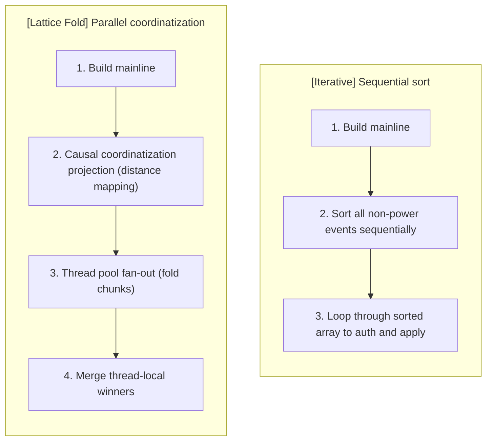

This post outlines an alternative approach to Matrix state resolution's
sequential mainline sort. By leveraging parallel causal coordinatization and a
commutative join-semilattice fold, the "lattice fold" algorithm offers an
exploratory hypothesis for performance improvements in large rooms with high
conflict rates, trading strict iterative auth-checks for a parallelizable
fixed-snapshot approximation.

## The iterative bottleneck

State resolution v2[^stateres_v2_spec] is fundamentally a two-stage process.
First, power events (like `m.room.create`, `m.room.power_levels`, and
`m.room.join_rules`) are sorted via Kahn's topological sort[^kahn_1962] and
iteratively applied. Second, non-power events are sorted by their "mainline
distance" (their closest position on the power-levels chain) and sequentially
applied.

When a room experiences a large state reset or significant conflict across many
state keys, the second stage becomes a bottleneck. The algorithm must
sequentially sort thousands of non-power events, and then iteratively loop
through the sorted array to run auth checks and apply the state. Because the
events are applied sequentially, it forces a single-threaded execution model for
the non-power phase, preventing implementations from utilizing available
hardware parallelism.

Some implementations try to mitigate this by early-caching or parallelizing auth
checks, but the fundamental sequential sort-and-apply loop remains an upper
bound on performance.

<!-- markdownlint-disable MD024 -->

### How lattice fold can help

Rather than sorting the entire non-power event list, the lattice fold assigns
each event a **mainline coordinate**. Events are then folded on a
per-`(type, state_key)` basis using a commutative
join-semilattice[^semilattice_def] **Least Upper Bound (LUB)** operator.

Because the tie-breaking logic (the LUB operator) is associative and
commutative, the fold is "embarrassingly parallel." A thread pool can split the
non-power events into chunks, validate and auth-check them concurrently, and
resolve the local winners.

### The Commutative Join Operator (LUB)

The core of the lattice fold is the LUB comparator, which determines if a new
event beats the current winner for a given `(type, state_key)` slot.

The comparison cascade is:

1. **Mainline position**: closer to the current power-levels event (smaller
   index) wins.
2. **`origin_server_ts`**: later timestamp wins.
3. **`event_id`**: lexicographically largest ID wins.

If an event is unauthorized or lacks a `state_key`, it is dropped before it can
compete for the LUB.

<!-- markdownlint-disable MD013 -->

| Approach       | Parallelism                            | Scalability for $N$ conflicts                               |
| -------------- | :------------------------------------- | :---------------------------------------------------------- |
| Iterative Sort | Single-threaded                        | $O(N \log N)$ sort + $O(N)$ sequential apply                |
| Lattice Fold   | Highly parallel (`std::thread::scope`) | $O(N \cdot D)$ coordinate projection + $O(N)$ parallel fold |

<!-- markdownlint-enable MD013 -->

### Internal Pipeline

In Rust implementations (like `rezzy`), the non-power phase is implemented by
three internal functions:

1. **`fold_lattice_chunk`** — processes a slice of events in a single thread,
   auth-checking each and folding per-`(type, state_key)` winners via the LUB
   operator.
2. **`merge_lattice_winners`** — merges thread-local winner maps back into the
   global result using the exact same LUB comparator.
3. **`compute_lattice_coordinatized_winners`** — orchestrates the parallel
   fan-out, splits events into chunks, and coordinates the fold-then-merge
   pipeline.

---

## Future considerations

For standard Matrix operations, the iterative sort is fast enough. However, when
building high-performance homeservers designed to handle massive rooms or rapid
federation bursts, unlocking multi-threading for state resolution is highly
desirable.

It's worth noting that V2.1+ rooms (incorporating MSC4297[^msc4297]) introduce a
conflicted subgraph for power events that slightly complicates the mainline
generation. While the lattice fold handles V2 seamlessly, V2.1+ implementations
currently fall back to the iterative loop. Formalizing the lattice fold in Lean
and proving convergence for the V2.1+ graph structures is an ongoing area of
research.

<!-- markdownlint-disable MD033 -->

_<u>AI Disclosure:</u> OpenAI's `codex` CLI Assistant used to pinpoint relevant
areas in Synapse's codebase. Fable 5 and Gemini 3.1 Pro Web assisted in
brainstorming ideas for and helping to check the initial code demo
implementation. Mermaid diagrams adapted from Gemini 3.1 Pro output._

<!-- markdownlint-enable MD033 -->

### Footnotes and references

[^stateres_v2_spec]:
    Matrix Specification: Room Version 2 State Resolution.
    <https://spec.matrix.org/latest/rooms/v2/#state-resolution>

[^kahn_1962]:
    Kahn, A. B. (1962). "Topological sorting of large networks". Communications
    of the ACM. <https://dl.acm.org/doi/10.1145/368996.369025>

[^semilattice_def]:
    A join-semilattice is a partially ordered set that has a join (a least upper
    bound) for any nonempty finite subset.
    <https://en.wikipedia.org/wiki/Semilattice>

[^msc4297]:
    MSC4297: State Resolution v2.1.
    <https://github.com/matrix-org/matrix-spec-proposals/pull/4297>
